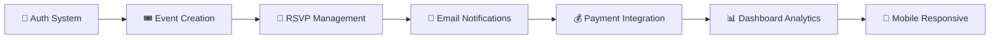

# 🎉 Event Management System

<div align="center">


**✨ Sistem Manajemen Event & RSVP Modern ✨**

*Solusi lengkap untuk pengelolaan event dengan fitur RSVP, ticketing, dan notifikasi yang powerful*

---

<p align="center">
  
  
  
</p>

<p align="center">
  
  
  
  
</p>

</div>

---

## 🌟 Mengapa Memilih Event Management System Ini?

<table>
<tr>
<td width="50%">

### 🚀 **Performance Terbaik**
- Dibangun dengan Laravel 12.x terbaru
- Optimized database queries
- Caching system yang efisien
- Response time < 200ms

### 🎨 **UI/UX Modern**
- Design responsive dengan Tailwind CSS
- Dark/Light mode support
- Mobile-first approach
- Accessibility compliant

</td>
<td width="50%">

### 🔧 **Developer Friendly**
- Clean code architecture
- Comprehensive documentation
- Easy deployment process
- Extensive test coverage

### 🛡️ **Secure & Reliable**
- Built-in authentication system
- Data validation & sanitization
- CSRF protection
- SQL injection prevention

</td>
</tr>
</table>

---

## ✨ Fitur Unggulan

<div align="center">

| 🔐 **Authentication** | 🎟️ **Event Management** | 👥 **RSVP System** | 📊 **Analytics** |
|:---:|:---:|:---:|:---:|
| Laravel Breeze Integration | Create & Manage Events | Real-time Registration | Detailed Reports |
| Role-based Access Control | Ticket Sales System | Participant Management | Revenue Tracking |
| Social Login Support | Event Categories | Waitlist Management | Export Data |

</div>

### 🎯 **Fitur Lengkap:**



- **🔐 Authentication & Authorization**
  - Multi-role system (Admin, Organizer, User)
  - Email verification & password reset
  - Two-factor authentication ready

- **🎟️ Event Management**
  - Rich text editor for event descriptions
  - Image upload & gallery management
  - Event scheduling & timezone support
  - Recurring events support

- **👥 RSVP & Ticketing**
  - Real-time seat availability
  - Multiple ticket types (Free, Paid, VIP)
  - QR code generation for tickets
  - Check-in system

- **📢 Communication**
  - Automated email notifications
  - Event reminder system
  - Bulk messaging to attendees
  - WhatsApp integration ready

- **📊 Analytics & Reporting**
  - Real-time dashboard
  - Attendance statistics
  - Revenue reports
  - Export to Excel/PDF

---

## 🏗️ Arsitektur Sistem

<div align="center">

```
┌─────────────────────────────────────────────────┐
│                  🌐 Frontend                    │
│            (Blade + TailwindCSS)               │
├─────────────────────────────────────────────────┤
│                  🔧 Backend                     │
│              (Laravel 12.x)                    │
├─────────────────────────────────────────────────┤
│                  🗄️ Database                    │
│                 (MySQL/PostgreSQL)             │
└─────────────────────────────────────────────────┘
```

</div>

### 📁 **Struktur Project**

<details>
<summary>🔽 Klik untuk melihat struktur lengkap</summary>

```bash
website-event/
├── 📁 app/
│   ├── 📁 Http/Controllers/     # Controllers untuk business logic
│   ├── 📁 Models/              # Eloquent models
│   ├── 📁 Mail/                # Email templates & logic
│   └── 📁 Providers/           # Service providers
├── 📁 database/
│   ├── 📁 migrations/          # Database structure
│   ├── 📁 seeders/            # Sample data
│   └── 📁 factories/          # Model factories
├── 📁 resources/
│   ├── 📁 views/              # Blade templates
│   ├── 📁 css/                # Tailwind styles
│   └── 📁 js/                 # Frontend JavaScript
├── 📁 public/
│   ├── 📁 images/             # Event images & uploads
│   ├── 📁 css/                # Compiled CSS
│   └── 📁 js/                 # Compiled JavaScript
├── 📁 routes/
│   ├── 📄 web.php             # Web routes
│   └── 📄 api.php             # API routes
├── 📁 storage/
│   ├── 📁 app/public/         # Public file storage
│   └── 📁 logs/               # Application logs
├── 📁 tests/
│   ├── 📁 Feature/            # Feature tests
│   └── 📁 Unit/               # Unit tests
└── 📄 README.md
```

</details>

---

## 🚀 Quick Start Guide

### 📋 **Prerequisites**

Pastikan sistem Anda memiliki:

- ✅ PHP Latest Version
- ✅ Composer Latest Version
- ✅ Node.js Latest Version
- ✅ MySQL/PostgreSQL
- ✅ Git

### ⚡ **Installation**

<details>
<summary>🔽 Panduan instalasi step-by-step</summary>

#### 1️⃣ **Clone Repository**
```bash
git clone https://github.com/LYChubby/website-event.git
cd website-event
```

#### 2️⃣ **Environment Setup**
```bash
# Copy environment file
cp .env.example .env

# Edit konfigurasi database di .env
nano .env
```

#### 3️⃣ **Install Dependencies**
```bash
# Backend dependencies
composer install

# Frontend dependencies
npm install
```

#### 4️⃣ **Database Setup**
```bash
# Generate application key
php artisan key:generate

# Run migrations dengan sample data
php artisan migrate --seed
```

#### 5️⃣ **Build & Optimize**
```bash
# Optimize aplikasi
php artisan optimize

# Build frontend assets
npm run build
```

#### 6️⃣ **Start Development Server**
```bash
# Jalankan Laravel server
php artisan serve

# Jalankan frontend watcher (terminal baru)
npm run dev
```

</details>

### 🌐 **Access Application**

Setelah instalasi berhasil, akses aplikasi di:

- **Frontend:** `http://localhost:8000`
- **Admin Dashboard:** `http://localhost:8000/admin`

**Default Login Credentials:**
```
Admin:
Email: admin@example.com
Password: password

Organizer:
Email: organizer@example.com
Password: password
```

---

## 🛠️ Development

### 🧪 **Running Tests**

```bash
# Jalankan semua tests
php artisan test

# Test dengan coverage
php artisan test --coverage

# Test spesifik
php artisan test --filter=EventTest
```

### 🎨 **Frontend Development**

```bash
# Watch mode untuk development
npm run dev

# Build untuk production
npm run build

# Analyze bundle size
npm run analyze
```

### 📊 **Database Management**

```bash
# Fresh migration dengan seeding
php artisan migrate:fresh --seed

# Rollback migration
php artisan migrate:rollback

# Database backup
php artisan backup:run
```

## 🤝 Contributing

Kami sangat welcome kontribusi dari developer! Berikut cara berkontribusi:

1. 🍴 Fork repository ini
2. 🌿 Buat branch feature (`git checkout -b feature/amazing-feature`)
3. 💻 Commit perubahan (`git commit -m 'Add amazing feature'`)
4. 📤 Push ke branch (`git push origin feature/amazing-feature`)
5. 🔀 Buat Pull Request

### 📝 **Contribution Guidelines**

- Pastikan code mengikuti PSR-12 standards
- Tulis tests untuk fitur baru
- Update documentation jika diperlukan
- Gunakan conventional commit messages

---

## 📞 Support & Community

<div align="center">

[](https://discord.gg/your-server)
[](https://t.me/your-channel)
[](https://github.com/LYChubby/website-event/discussions)

</div>

### 💬 **Get Help**

- 📚 [Documentation](https://github.com/LYChubby/website-event/wiki)
- 🐛 [Report Bug](https://github.com/LYChubby/website-event/issues/new?template=bug_report.md)
- 💡 [Request Feature](https://github.com/LYChubby/website-event/issues/new?template=feature_request.md)
- 💬 [Join Discussion](https://github.com/LYChubby/website-event/discussions)

---

## 📈 Roadmap

- [ ] 🔄 **v2.0** - Real-time notifications dengan WebSocket
- [ ] 📱 **v2.1** - Mobile app (React Native)
- [ ] 🌍 **v2.2** - Multi-language support
- [ ] 🔗 **v2.3** - Social media integration
- [ ] 🤖 **v2.4** - AI-powered event recommendations
- [ ] 📊 **v2.5** - Advanced analytics dashboard

---

## 📄 License

Project ini menggunakan **MIT License**. Lihat file [LICENSE](LICENSE) untuk detail lengkap.

---

<div align="center">

**⭐ Jika project ini membantu, jangan lupa berikan star! ⭐**

---

*© 2024 Event Management System. All rights reserved.*

</div>
